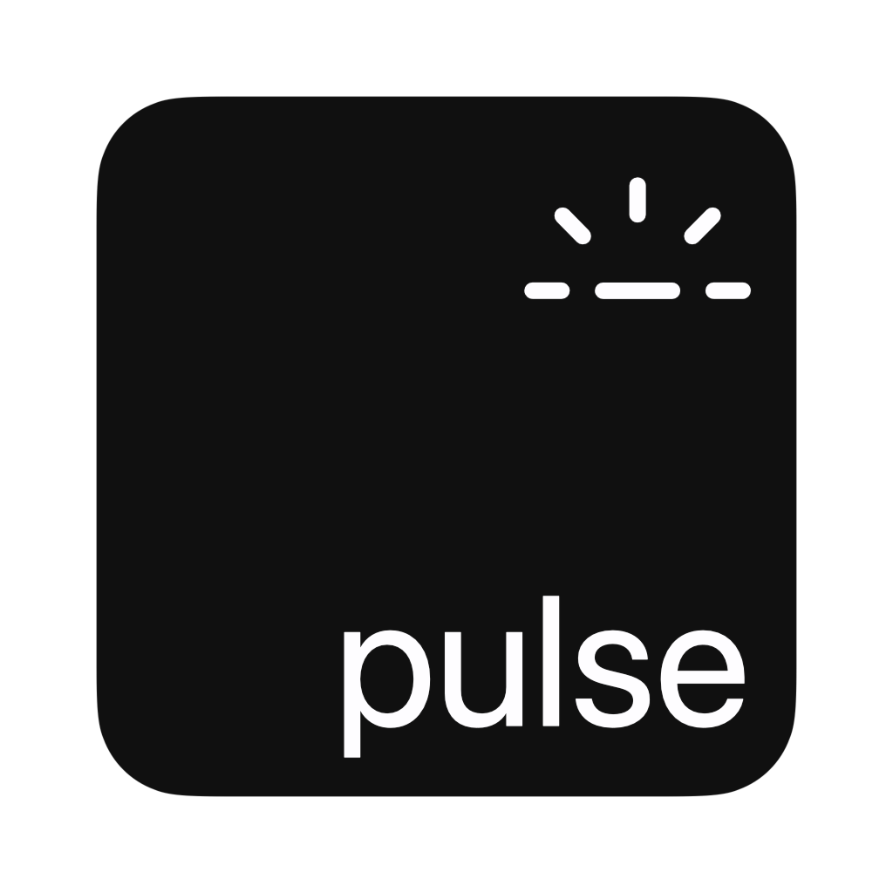

# KBPulse
Pulse the backlight on your Mac keyboard

<a href="https://www.youtube.com/watch?v=0plJtiXuT0U">Demo</a>

## Compatibility
KBPulse should work on any MacBook running a version of macOS that has CoreBrightness.framework. I've confirmed that CoreBrightness exists in 10.13+, and probably even before then.

I have personally tested this on a 2020 M1 MacBook Pro 13" with Touch Bar. But CoreBrightness is a very abstract high-level framework and I'm willing to bet it works with *every* MacBook regardless of hardware.

## Installation
I am struggling to understand GitHub Actions. In the meantime, just build it. As long as you have Xcode, it won't take more than two clicks.

## Building
The private header files are already included for you. Simply download the project and open it in Xcode. Then, press Cmd-R or click Run. 

You can also open the build products folder and copy the binary to a directory of your choice. 

## Running
KBPulse has one optional launch argument: the name of the theme (without the path or extension). If you do not provide a launch argument, Yawn will be used.

```sh
$ ./kbpulse
```

```sh
$ ./kbpulse Yawn
```

## Configuration
Configuration files (.json) are stored in `~/Documents/KBPulse`. (This location will likely change in the future.) Yawn.json is the default theme. Copy it to make your own.
The array of animations is not limited to two animations. You can add as many as you want!

### Yawn.json
```json
{
  "Author" : "EthanRDoesMC",
  "Version" : "1.0.0",
  "Homepage" : "https:\/\/ethanrdoesmc.com\/",
  "Preview Image URL" : " ",
  "Animations" : [
    {
      "Description" : "Fades the keyboard to full brightness",
      "Name" : "Fade In",
      "Fade Duration" : 2500,
      "Brightness" : 1,
      "Delay" : 0
    },
    {
      "Description" : "Fades the keyboard to off",
      "Name" : "Fade Out",
      "Fade Duration" : 2500,
      "Brightness" : 0,
      "Delay" : 0
    }
  ],
  "Name" : "Yawn (default)",
  "Description" : "A calm, breath-like animation that somewhat resembles the sleep indicator on older MacBooks."
}
```
